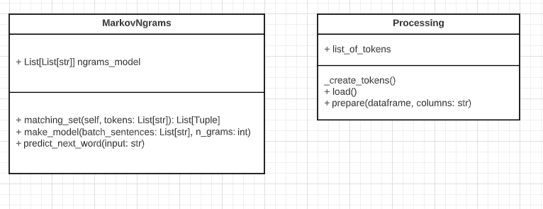
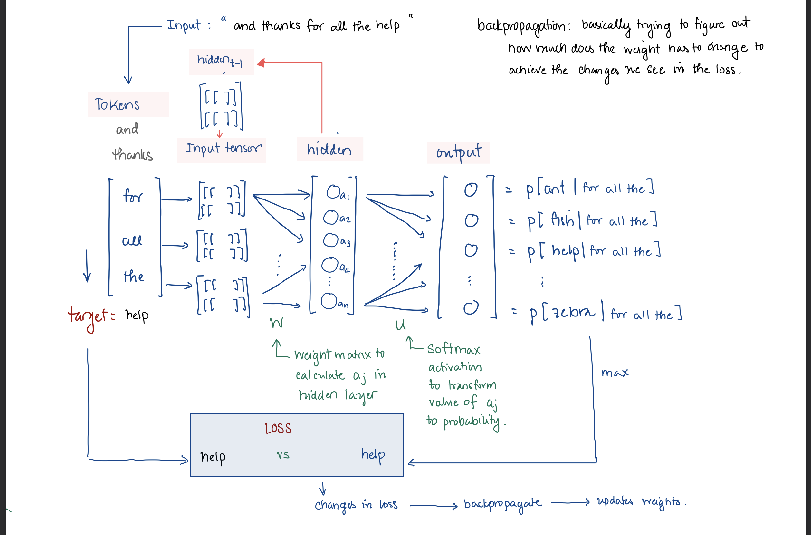
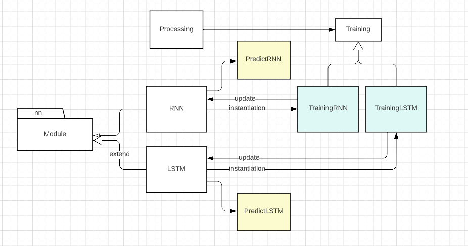
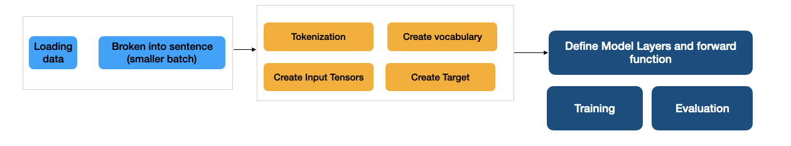

# Various Natural Language Generation task with Markov Process and Recurrence Neural Network

Author: My Nguyen  
MET CS664 A1 - Fall 2022 - Artificial Intelligence

## 1. Setup
To start developing or using the project:

- clone this project

```
git clone
```
- create a virtual environment


- install dependencies and module

```bash
pip install -e .
```

## 2. Project Structure

This project has the following important submodule

- dataset: where data is stored
- language_helper: is module contains core applications (model code, data processing, train, predict)
- tests: unit tests for the module

The `language_helper` structure is as followed
```
language_helper  
    |  
    |____markov  
         |____model.py  
         |____data.py
    |____rnn
         |____encode.py
         |____data.py  
         |____model.py
         |____predict.py
         |____train.py
    |____evaluation.py

```

Since markov model and rnn model are different in their implementation details, they are broken into their separate module

## 3. Data and Encoding Process
The Data Loading and Processing step is encapsulate in `data.Processing` class. And additional cleaning method can be added to `data.Processing` 
### 3.1. Tokenization

Tokenization is the process of breaking down input string to a list (or array) of tokens. Tokens can be a word, punctuation mark, numbers. etc

For example, if we have an input string:

```python
"hello how are you?"
```
then, 

```python
tokens = ["hello", "how", "are", "you", "</s>"]
```

in `Processing` class, the tokenization step is in

```python
def _create_tokens(self, dataframe, column) -> List[List[str]]:
     """
     From column in a dataframe, process each input string
     and return a list of tokens
     """
```

### 3.2. (RNN and LSTM only) Tensor
For pytorch's Neural Network, input to the network are 3-dim tensors, so additional encoding to transform input's Tokens to tensors are required. 

An input Tensor with dimension [length_of_sentence, 1, vocabulary_size] to the network looks something like:

```
[[[0, 1, 0]],
[[1, 0, 0]]]
```

To create a Tensor like so, there are 3 steps:

- Step 1: tokenization (see section 3.1)
- Step 2: create vocabulary of words. This involve extracting all unique tokens in the dataset, and create a mapping (dictionary) with index for each unique token. This step is done in `data.Processing` class

```python
def _create_vocab_mapping(self, list_of_tokens) -> Tuple[Dict[str,str], Dict[str, int]]:
     """
     from input sequences of tokens for each string, add to dictionary
     Args:
          - list_of_tokens List[List[str]]: list contains sentences. Each sentence
          is broken into tokens. 
          for example: [["hello", "how", "are", "you"], 
                         ["hi", "how", "are", "you"]]
     
     Returns:
          - vocabulary mapping Dict[str, str]: is the mapping of each unique word in
          the training set to a unique integer index
          For example: {0: "hello", 1: "hi", 2: "how", 3: "are", 4: "you"}

     """
```

- Step 3: encoding (transform sentence to tensor). This step is done in `encode.EncodeUtility`

```python

def sentence_to_tensor(self, tokens: List[str], vocab_size: int):
     """
     Create a tensor for each sentence.

     Args:
          - tokens: a sentence splited into token. 
          For example: ["hi", "how", "are", "you", "</s>"]
     Return:
          - tensor: a 3-dimensions array-like object of size
          [length_of_sentence, 1, vocabulary_size]
          For example:
               [[[0, 1, 0]],
               [[1, 0, 1]]]
     """
```

To illustrate, let say we have vocabulary containing 5 words 
```
{0: "hello", 
1: "hi", 
2: "how", 
3: "are", 
4: "you"}
```

and a sentence `"how are you"`. After the `sentence_to_tensor` step, we'll have a tensor that looks like

```
[
     [[0, 0, 1, 0, 0]],  # binary 1 at index position of "how" in vocabulary
     [[0, 0, 0, 1, 0]].  # binary 1 at index position of "are" in vocabulary
     [[0, 0, 0, 0 ,1]]   # binary 1 at index position of "you" in vocabulary
]

```

### 3.3. (RNN and LSTM only) Formulating Target Tensor
In Natural Language Generation problem, the target output is the next word that the model should be guessing, given the input string. So the **target tensor** is extracted from the sentence. For example:

```python
input_tokens =  ["hi", "how", "are", "you"]

target_tokens = ["how", "are", "you", "</s>"]
```
, 

```python
So, at iteration = 0, the model is being trained
     input = "hi"
     target = "how"
     output = "something"
```
the output of the model will be compared against the target, and calculate the loss

## 4. Markov Model
### 4.1. Design

```
language_helper  
    |  
    |____markov  
         |____model.py  
         |____data.py
```

This is a relatively simple engine using Markov Chain to get the next probable word, given the input word. Recall how your keyboard usually suggests the next word for you as you are typing, this could be achived with a simple Markov process.
The nature of this task is simple, and the generated sequence is usually short (next one word), and user give the immediate feedback as to what word is "correct" by interactively choosing from the pool of suggested words, we do not need to implement entire language model for this task. Rather, the engine calculate the frequencies of candidate words in a pool of NGrams.

The `markov.model.MarkovNgrams` class has the prebuilt model for next word suggestion. The UML diagram is below.



This class has 2 most important methods

```python
def make_model(self, batch_sentences: List[str], n_grams: int) -> List[List[str]]:
     """
     Go thru set of sentences, break sentences into ngrams.
     Finally return a list of ngrams token.
     For example, if we have a sentence:
          
          ["hi", "how", "are", "you"]
     
     With n_grams = 3, we will generate lists of tokens, with each list
     has length 3. The final index token is the word we want to predict, given
     the last 2 previous words

          [
               ["hi", "how", "are"],
               ["how", "are", "you"]
          ]

     The first list ["hi", "how", "are"] try to represent P["are" | "how", "hi"].
     These lists of of tokens will be used to calculate the frequency of the last word,
     for each Markov state.

     ------------------------------------------------------
     Args:
          + batch_sentences: list of sentence we want to create ngrams from
          + n_grams (int): the number of ngrams to generate.

     Returns:
          + ngrams_model: lists of token. Each list has `n_grams` number of token
          For example: 
          [   
               ["hi", "how", "are"],
               ["how", "are", "you"]
          ]
     """
```

and training model after `making_model`

```python
def predict_next_word(self, input: str):
     """
     From input, find the next best word based on the likelihood (frequency) 
     of that word given that `input_token` is the preceeding word.

     For example, if the ngrams_model contains the following entries:
          [
               ("hi", "how", "are"),
               ("how", "are", "you")
               ("hi", "how", "are"),
               ("how", "are", "your"],
               ("are", "your", "dog")
          ]
     And input_tokens = "how are". Model finds entries with the first 2 tokens
     contains "how", "are". Then its counts the number of times the last word being "you", "your", etc.
     Finally, it select the word with the highest frequency.

     Args:
          - input (str): is the input string that we will use to predict the next word

     Returns:
          - chosen_word, p_chosen_word (Tuple[str, float]): the chosen word and its corresponding
          frequency

     """
```

### 4.2. Run the model
To run the model, data need to be first available in `dataset/<domain>` folder
```
dataset
     |__<domain>
            |____<file>.csv or <file>.json
``` 

In this project I attached the 2 datasets I am using, the QA dataset (under qa domain) and chat dataset, under (chat domain) 

Next, load using `data.Processing`. Detail about `data.Processing` is described above.

```python
from language_model.markov import Processing

processor = Processing()
processor.prepare()
```

To start making the model, call a new instance of `model.MarkovNgrams` and provide the sentences processed with `Processing`, and `ngrams`.

(Also refer to docstring of how the input looks like)

```python
from language_model.markov import MarkovNgrams

markov = MarkovNgrams()
markov.make_model(batch_sentences=processor.list_of_tokens, n_grams=3)
```

Finally, we can start feeding input to this model

```python 
input = "pretty"
chosen_word, p_chosen_word = markov.predict_next_word(input=input)
```

## 5. Sentence Generation with Vanilla Recurrence Neural Network
### 5.1. RNN Architecture and Design




The `rnn` module has pre-built model training process from Data Processing to prediction. Since we are using `pytorch`, the module is broken down to pytorch's recommendation

- data: contains the data loading and processing feature
- encode: This module encode input lists of tokens and create Tensor. Tensor contains One-Hot Encoded Vector of each token in the sentence
- model: contains neural network layer definition
- train: contains training procedure for each model
- predict: contains predict procedure for each model

Since there are some similarity between RNN and the LSTM (section 6), we're having subclass for each model, so that running each model is the same. Below is UML class diagram for this `rnn` module
 



The overall Data Load, Training, and Prediction looks something like so:




### 5.2. Define Neural Net with pytorch
To start defining the Neural Network layer with pytorch frameword, all we need to do is extending from `nn.Module` class, define our specific input parameters and layers, then, connect those layers in `forward()` function


```python
class RNN(nn.Module):
    """
    simple RNN network with 1 layer
    """
    def __init__(self, input_size, hidden_size, output_size):
        super(RNN, self).__init__()

        self.hidden_size = hidden_size

        self.i2h = nn.Linear(input_size + hidden_size, hidden_size)
        # self.h2h = nn.Linear(hidden_size, hidden_size)
        self.i2o = nn.Linear(input_size + hidden_size, output_size)
        self.dropout = nn.Dropout(0.1)

``` 

connect those layers in `forward()` function

```python

def forward(self, input, hidden):
     combined = torch.cat((input, hidden), 1)
     hidden = self.i2h(combined)
     output = self.i2o(combined)
     return output, hidden
```

Notice how the both hidden layer `i2h` and output layer `io2` has `hidden` parameter as the input. This is because we need to feed the hidden tensor from previous iteration back to the model itself.

When the model is in training, pytorch invoke `forward` to create a computation graph to then create the output, and hidden layer. Next, we will need to calculate the loss from this output, and backpropagate this loss to update the weights

more detail here https://pytorch.org/tutorials/beginner/introyt/introyt1_tutorial.html

### 5.3. Training model with pytorch

Pytorch has made it structural to train a neural network model, and all the step are pretty much standardize. In this project, we abstract the model training in `train.Training` class. Each model type will have its own subclass. For example, RNN will have `TrainingRNN` subclass for its training detail.

We instantiate `Training` class with appropriate parameters, and invoke training by calling `run()` method. In pytorch, the generatl training process follow this flow:

- Define model with Parameters
- Define loss (in NLG we use CrossEntropyLoss)
- Iterate over a dataset of inputs
- Zero Out Gradient
- process input thru model
- compute Loss
- backpropagate the loss to netword
- update the weights

### 5.4. Run the Model

To run the model, data need to be first available in `dataset/<domain>` folder
```
dataset
     |__<domain>
            |____<file>.csv or <file>.json
``` 

In this project I attached the 2 datasets I am using, the QA dataset (under qa domain) and chat dataset, under (chat domain) 

Next, load using `data.Processing`. Detail about `data.Processing` is described above.

```python
from language_helper.rnn.data import Processing

processor = Processing(data_domain="qa", delimiter="\t")
dataframe = processor.load()
processor.prepare(dataframe, "question")
```

To start making the model, call a new instance of `rnn.model.RNN` and provide the sentences processed with `Processing`.

(Also refer to docstring of how the input looks like)

```python
from language_helper.rnn.model import RNN
from language_helper.rnn.predict import PredictRNN
from language_helper.rnn.encode import EncodeUtility
from language_helper.rnn.train import TrainingRNN
from torch.nn import CrossEntropyLoss

# model
model = RNN(input_size = len(processor.vocabulary_mapping), 
            hidden_size=128,
            output_size=len(processor.vocabulary_mapping))

# trainer
trainer = TrainingRNN(model=model, \
                    criterion=CrossEntropyLoss(), \
                    training_set=processor.list_of_tokens, \
                    encode = EncodeUtility(vocabulary_mapping= processor.vocabulary_mapping), \
                    n_iterations=1000, \
                    learning_rate=0.001)


trainer.run()
trainer.plot()
```

Finally, we can start feeding input to this model

```python 
input = "is"
predicted_string = PredictRNN.predict(input_sentence=input, 
                        rnn=model, 
                        encode=EncodeUtility(vocabulary_mapping=processor.vocabulary_mapping), 
                        hidden_size=128, 
                        vocabulary_mapping=processor.vocabulary_mapping, output_length=4)
print(f"Resulted String: {' '.join([input] + predicted_string)}")
```

## 6. Sentence Generation with Long Short Term Memory

### 6.1. LSTM Architecture and Design

**LSTM** is part of the RNN family and since we are using pytorch, it is a subclass of pytorch's `nn.Module`. The design for this module is the same as Vanilla Recurrence Neural Network, except that we need to using `LSTM()` layer, and intead of having 1 hidden state to feed back to input, we have 2 states `hidden` and `cell`. Their model specific code is in subclass `model.LSTM`, `train.TrainingLSTM` and `predict.PredictLSTM`.


### 6.2. Run the Model
Run the model steps for LSTM is identical to that of RNN, since all details are abstracted away. You will only need to replace the RNN instance with LSTM
For example

```python
lstm = LSTM(input_size = len(processor.vocabulary_mapping), 
            hidden_size=128,
            layer_size=2
            output_size=len(processor.vocabulary_mapping))

trainer_lstm = TrainingLSTM(model=lstm, \
                criterion=CrossEntropyLoss(), \
                training_set=processor.list_of_tokens, \
                encode = EncodeUtility(vocabulary_mapping= processor.vocabulary_mapping), \
                n_iterations=1000, \
                learning_rate=0.001)
trainer_lstm.run()

input = "is"
predicted_string = PredictLSTM.predict(input_sentence=input, 
                        rnn=lstm, 
                        encode=EncodeUtility(vocabulary_mapping=processor.vocabulary_mapping), 
                        hidden_size=128, 
                        vocabulary_mapping=processor.vocabulary_mapping, output_length=4)
```
## 7. Module Testing
Checkout unit tests under `tests`. 

## 8. Run Example Model
After **Setup**, we can uses the module as a regular python package. Or, uses the setup notebook examples
`rnn_lstm.ipynb` or  `markov.ipynb`

This project can be turned into a flask app with pytorch framework
